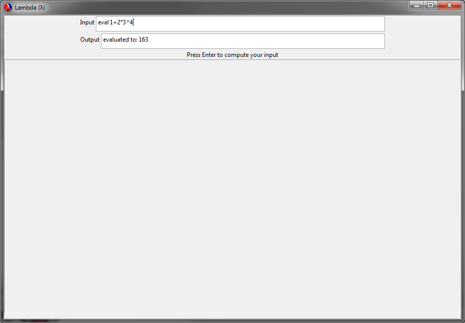

#Lambda
##ShuddaWuddaCdr

##Authors
- **Brian Carlson**
- **Joshua Caravetta**
- **Norman Mutunga**


##Overview
The goal is to create a core mathematical engine that is simple, powerful and easy to build upon. Simple in terms that it allows the user to enter their equation to evaluate in infix notation, along with english keywords to further define operations on the equation. The power of Lambda will come from the ease at which the mathematical engine backend can be expanded on to add new math functionality.


##Screenshots
*Here are some screenshots of Lambda's initial UI, and inputs using keywords `'eval` ,`'plot` and `'deriv`*




##Concepts Demonstrated
- **Abstraction** - The backend uses a method of **KeyPairs** to create a database of keywords with a paired procedure. An abstraction barrier is made between the database and the user, so one can simply add a key and paired procedure to the database with `add-keyword`.

- **Lexical Parsing** - `exp-lexer` uses lexical parsing tools, along with regex to tag input data strings. `read-arith` uses regex to re-organize infix notation equations into prefix notation equations. Finally, the `main-parser` uses the power of the `exp-lexer` to extract keywords and format equations for evaluation in the backend.

- **Key Procedures** - These procedures were added and constructed with ease to read in mind. Each procedure is placed in its own racket source file, and included into the `Keyword Definitions`. The calls to these procedures in their **KeyPair** definitions are simple and abstracted from the low level source code.

- **GUI Strategies** - Norm

##External Technology and Libraries
- **[Plot][1]** - This library was used to create plots in Lambda's GUI canvas with use of the `'plot` keyword.
- **[GUI][2]** - This library was used to create Lambda's GUI.
- **[Parser][3]** - This library was used to create the `exp-lexer`, that extracts and tags all data types from the user input string.

##Favorite Lines of Code
####Brian
The `main-parser` procedure takes the complete english keyword and infix notation expression from the frontend GUI and breaks it up into a keyword list and equation string with the help of a lexical parser. It then ensures that the keyword list is not empty, if it is, then it inserts the `'eval` keyword in. It will then check to make sure proper notation/operators are used in the equation. Finally, the `main-parser` strips the lexical parser tags from the equation string and calls the backend `evaluator` with the keyword and the equation string. 

This procedure uses many helper functions, along with many `map` and `filter` calls.

```
(define (main-parser in-exp) 
  (let (
        [exp (exp-lexer (open-input-string in-exp))] ; lex the in-exp and store it locally
        [k-list '() ] ; list for keywords
        [e-list '() ] ; list for expression
        )
    
    ;; -- Helper Functions --
    (define (is-keyword? item)
      (and (equal? 'ID (car item)) ( > (string-length (symbol->string (car (cdr item)))) 1))
      )
    
    (define (is-equation? item)
      (or    (equal? 'OP (car item)) ; OP - operation
             (equal? 'INT (car item)) ; INT - numbers
             ;(equal? 'LPAR (car item)) ; LPAR - Left Paren
             ;(equal? 'RPAR (car item)) ; RPAR - Right Paren
             (and (equal? 'ID (car item)) ( = (string-length (symbol->string (car (cdr item)))) 1)) ; ID - variables
             )
      )
    
    (define (is-var? item)
      (equal? 'ID (car item))
      )
    
    (define (add-mult l1)
      (define (iter in out)
        (cond 
          ((empty? (cdr in)) (append out (list (car in))))
          ((and 
            (equal? 'INT (car (car in))) 
            (equal? 'ID (car (car (cdr in)))))  (iter (cdr in) (append out (list (car in)) (list (list 'OP  '*)))) )
          (else (iter (cdr in) (append out (list (car in)))) )
          )
        )
      
      (iter l1 '())
      )
    
    (define (rem-tags item)
      (car (cdr item)) ; returns the symbol of the data 
      )
  
    ; --- Parse in-exp ---
    
    ; Filter in-exp for keywords, append all keywords to k-list
    (set! k-list (map rem-tags (filter is-keyword? exp)))
    
    ; Filter in-exp for equation, append equation to e-list
    (set! e-list (add-mult (filter is-equation? exp)))
    
    ; Now input is separated into two lists:
    ; k-list has only keywords in it (no tags)
    ; e-list has the full, unaltered equation (with tags)
    
    ;; --- Evaluate call to backend ---
    
    ; Here we are going to check if the user just wants to evaluate a generic, numbers only math equation
    (cond
      ((and (empty? k-list) (empty? (filter is-var? e-list))) (set! k-list (list 'eval)))
      ((and (empty? k-list) (not (empty? (filter is-var? e-list)))) (set! k-list (list 'err)))
      )
    
    ; Remove tags from e-list
    (set! e-list (map rem-tags e-list))
    
    ; --- Call Backend with k-list and e-list ---
    ; only calls with one keyword for now, passes e-list as string
    (evaluate (car k-list) (lst-to-str e-list))
    
    )
  )
```

####Josh

The `key-pair` is used to link keywords to their procedures. It allows users to add keywords to the system. The parser will update to include the added keywords automatically. This object paired with a few procedures that are then used with abstraction to give the user two procedures to call that alows them to interact with the object.

This scheme object uses helper functions, filter calls, and levels of abstraction to achieve its goals. 
```
;Key pair object. 
(define (key-pair keyword procedure)
  (define (dispatch m)
    (cond ((eq? m 'get-keyword) keyword)
          ((eq? m 'get-procedure) procedure)))
  dispatch)

;Key pair getter for keyword.
(define (get-keyword key-pair)
  (key-pair 'get-keyword))

;Key pair getter for Procedure.
(define (get-procedure key-pair)
  (key-pair 'get-procedure))

;List that holds all key-pairs.
(define key-pair-list '())

;Adds key-pair to the key-pair-list.
(define (add-key-pair key-pair)
  (set! key-pair-list (cons key-pair key-pair-list)))

;Removes key-pair from the key-pair-list.
(define (remove-key-pair keyword)
  keyword)

;Finds the key-pair object from the given keyword.
(define (find-key-pair keyword)
  (filter (lambda (x)
            (if (eq? keyword (get-keyword x))
                #t
                #f)) key-pair-list))

;Creates a keyword in the system.
(define (create-keyword keyword procedure)
  (add-key-pair (key-pair keyword procedure)))

;----Low Level-----
;----------------------------------------------Abstraction Level---------------------------------------------------------------
;----High Level----  

;Adds a new keyword to the system.
(define (add-keyword keyword procedure)
  (create-keyword keyword procedure))

(define (get-definition keyword)
  (get-procedure (car (find-key-pair keyword))))

```

####Norman
This procedure reads in a string from the `Input` field of the GUI, hands it over to the `main-parser` procedure that parses the expression. The evaluated result is then returned from the backend `evaluator` and placed into the `outputString`. The `outputString` is sent to the `Output` field of the GUI so the user can see the result. If the `plot` keyword is used the user can also see the plot on the canvas of the GUI.

```
;(init-value "Expression")
      (callback (λ (input-field event)
            (cond
             ; If a user hits enter to compute an equation
            ((equal? (send event get-event-type) 'text-field-enter) 
             (begin
             ; Clear canvas
             (send pb erase)
             ; Set outputString to solved equation
             (set! outputString (main-parser (send input-field get-value)))
             ; Send outputString to output-field
            (send output-field set-value outputString))))))
```

##Additional Remarks / Project Status
- Working frontend GUI with input, output and plot canvas fields.
- Working general expression parser that handles initial keyword and equation parsing.
- Working infix->prefix parser that handles transforming input equation to prefix for evaluation (handles operator precedence).
- High and Low level abstracted backend that forms a dynamic database of key pairs for additional mathematical procedures based on keywords.
- Evaluation of basic equations with any combination of the following operators: **-,+,/,\*,^**.
- Plot of basic equations with any combination of the following operators: **-,+,/,\*,^** and variable **x**. 
- Working keywords: eval, plot, deriv. *(deriv currently only works with **+,\*,^**. and its output isn't formatted correctly)*
- Other planned keywords: simplify.

#How to Download and Run

1. Download the latest release from here: *release link to come*
2. Open and run Lambda.rkt
3. Input expression is typed into the `Input`, using syntax: `keyword equation`
4. Output is seen in the `Output` or lower canvas depending on keywords used.

**Example 1: `eval`** 
- `eval` is the default keyword if no keyword is entered.
- `eval 1+2*3^4` or `1+2*3^4` will both evaluate to: 163.
- If `eval` is used on an equation with a variable, such as `x+2`, it will return `cannot evaluate: x+2` since there is a variable.

**Example 2: `plot`** 
- `plot x^2+x+3` - support for only one variable **x** is currently available.
- This will plot `x+2*x+3` in the lower canvas field

**Example 3: `deriv`** 
- `deriv  6*x + 30*x` will output 36 .
- `deriv` of `x + 2` will output 1 . 

[1]: http://docs.racket-lang.org/plot/
[2]: http://docs.racket-lang.org/gui/
[3]: http://docs.racket-lang.org/parser-tools/index.html?q=~a
